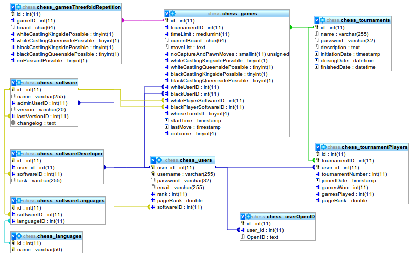
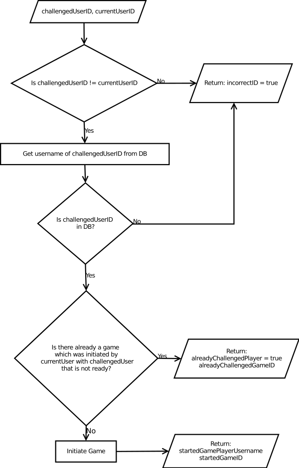
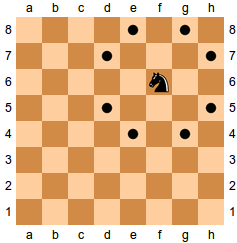
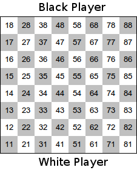

Database
========
Schema
------

Prepared Statements
-------------------

Table chess_users
-----------------
This table is needed to let the user login and to display a name
instead of an ID.
It also contains ranking information that takes long to calculate.

Table chess_userOpenID
-----------------------
Every user can have any number of OpenIDs to login

chess_games
-----------
This table stores information that is related to one game. This 
includes the players (whiteUserID, blackUserID), a possible time 
limit when they have to move, the lastMove time to check the time
limit, a list of all moves in moveList (separated by newlines \n).
The software that both players use to play this game, whoseTurnIsIt
and if the current game is part of a tournament (tournamentID).
`noCaptureAndPawnMoves` counts how many turns no capture and no pawn 
move happened. This is important for the 50-moves-rule.

chess_gamesThreefoldRepetition
------------------------------
This stores all game situations that have appeared for every game.
This is needed for threefold-repetition-rule.

chess_tournaments
-----------------
You can make tournaments in community chess. They can be open
or closed (password).

chess_software, _softwareDeveloper, _softwareLanguages, _languages
------------------------------------------------------------------
Community chess allows developers to let their Chess-AIs compete.
You can give Community Chess information about your software, wo
developed it and the language in which it was written.

Chess
=====

